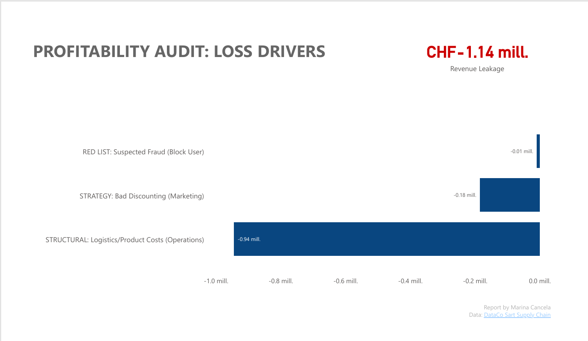

# 📉 Supply Chain Profitability Audit: Loss Drivers

**Project Status:** Completed  
**Tools:** PostgreSQL, SQL (CTEs, Views), Power BI

### 🎯 Objective
To identify the root causes of negative profitability in the supply chain. The initial hypothesis suggested "Fraud" as the main driver, but data analysis was required to confirm this.

### 🔍 Key Findings (The Truth)
After auditing **1.1 Million (CHF)** in revenue leakage (losses):
1.  **Operational Costs are the main issue:** 80% of losses come from legitimate customers with structural logistics costs (shipping/product costs > revenue), NOT fraud.
2.  **Fraud is minor:** "Suspected Fraud" accounts for less than 5% of total losses.
3.  **Action Plan:** Shift strategic focus to internal operational inefficiencies. Prioritize renegotiating shipping rates and product margins for the "Structural Loss" segment.

### 📊 Dashboard Preview

*(Note: If the image above doesn't load, check that your file is named exactly 'loss_drivers.png' inside the 'reports' folder)*

📄 **[View Full PDF Report](reports/loss_drivers.pdf)**

### 🛠️ Technical Process
1.  **Data Quality Check:** Analyzed data distribution to ensure reliability.
2.  **SQL Logic:** * Created `vw_loss_drivers` using CTEs to isolate **Internal Revenue Leakage** from External Fraud.
    * Logic: `CASE WHEN` to classify losses into Operational/Structural (Internal) vs. Suspicious Activity (External).
3.  **Visualization:** Power BI dashboard focusing on "Revenue Leakage" rather than potential profit.

---
*Report by Marina Cancela* *Data Source: [DataCo Smart Supply Chain Dataset](https://data.mendeley.com/datasets/8gx2fvg2k6/3)*
